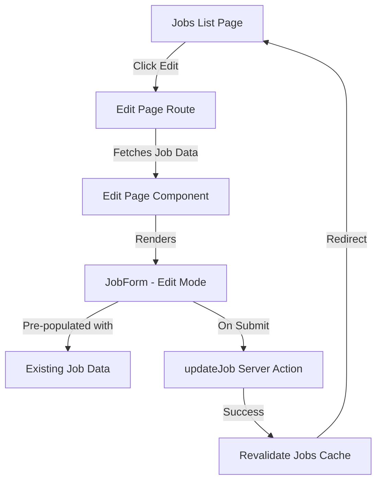
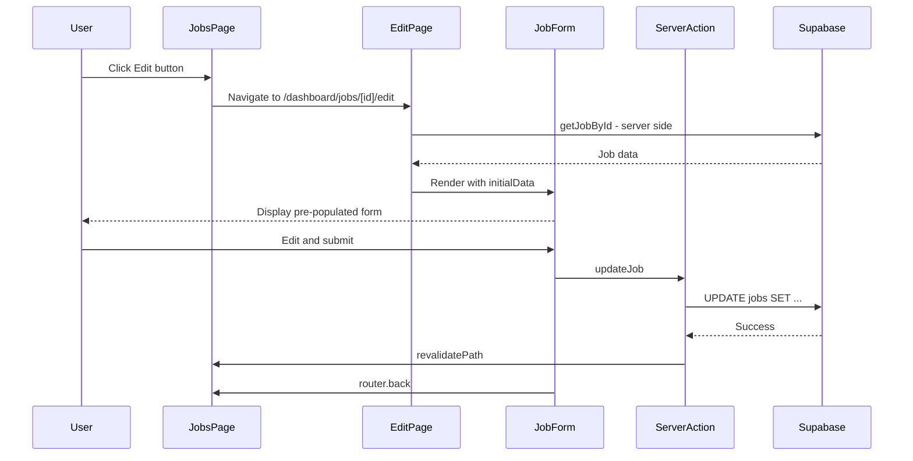

# Job Posting Edit Functionality - Implementation Plan

## Overview

This plan outlines the implementation of edit functionality for job postings. The approach reuses the existing `NewJobForm` component with conditional logic to support both create and edit modes.

## Architecture



## Implementation Steps

### 1. Add `updateJob` Server Action

**File:** [`lib/actions.ts`](lib/actions.ts)

Add a new server action to update an existing job:

```typescript
export async function updateJob(
  jobId: string,
  data: JobFormData,
): Promise<{ success: boolean; error?: string }> {
  const supabase = await createClient();

  const { error } = await supabase
    .from("jobs")
    .update({
      title: data.title,
      description: data.description,
      location: data.location,
      department: data.department,
      job_type: data.jobType,
      updated_at: new Date().toISOString(),
    })
    .eq("id", jobId);

  if (error) {
    return { success: false, error: error.message };
  }

  revalidatePath("/dashboard/jobs");
  return { success: true };
}
```

### 2. Add `getJobById` Data Fetcher

**File:** [`lib/data/job.ts`](lib/data/job.ts) (new file)

Create a server-side data fetcher to get a single job by ID:

```typescript
import { createClient } from "@/lib/supabase/server";
import type { JobRow } from "@/lib/types/job";

export async function getJobById(id: string): Promise<JobRow | null> {
  const supabase = await createClient();

  const { data, error } = await supabase
    .from("jobs")
    .select("*")
    .eq("id", id)
    .single();

  if (error || !data) {
    return null;
  }

  return data as JobRow;
}
```

### 3. Add `useJob` Hook

**File:** [`hooks/use-jobs.ts`](hooks/use-jobs.ts)

Add a hook to fetch a single job by ID using TanStack Query:

```typescript
async function fetchJobById(id: string): Promise<JobRow> {
  const supabase = createClient();

  const { data, error } = await supabase
    .from("jobs")
    .select("*")
    .eq("id", id)
    .single();

  if (error) {
    throw new Error(error.message);
  }

  return data;
}

export function useJob(id: string) {
  return useQuery({
    queryKey: jobKeys.detail(id),
    queryFn: () => fetchJobById(id),
    enabled: !!id,
  });
}
```

### 4. Create Edit Page Route

**File:** [`app/dashboard/(fullscreen)/jobs/[id]/edit/page.tsx`](<app/dashboard/(fullscreen)/jobs/[id]/edit/page.tsx>) (new file)

Create a dynamic route for the edit page:

```typescript
import { JobForm } from "@/components/forms/new_job_form";
import { getJobById } from "@/lib/data/job";
import { getMyProfile } from "@/lib/data/user";
import { notFound } from "next/navigation";

interface EditJobPageProps {
  params: Promise<{ id: string }>;
}

export default async function EditJobPage({ params }: EditJobPageProps) {
  const { id } = await params;
  const profile = await getMyProfile();
  const job = await getJobById(id);

  if (!profile || !job) {
    notFound();
  }

  return (
    <div className="flex justify-center items-center p-10 pb-0">
      <JobForm startupId={profile.id} initialData={job} />
    </div>
  );
}
```

### 5. Modify JobForm to Support Both Modes

**File:** [`components/forms/new_job_form.tsx`](components/forms/new_job_form.tsx)

Rename and modify the form component:

**Key Changes:**

1. Rename component from `NewJobForm` to `JobForm` (keep backward compatibility with export)
2. Add `initialData` prop for edit mode
3. Add `jobId` prop to identify which job to update
4. Conditionally call `createJob` or `updateJob` based on mode
5. Update form default values when `initialData` is provided
6. Update button text based on mode

```typescript
interface JobFormProps {
  startupId: string;
  initialData?: JobRow; // For edit mode
  jobId?: string; // For edit mode
}

export function JobForm({ startupId, initialData, jobId }: JobFormProps) {
  const isEditMode = !!initialData && !!jobId;

  const form = useForm<JobFormData>({
    resolver: zodResolver(newJobSchema),
    defaultValues: {
      title: initialData?.title ?? "",
      description: initialData?.description ?? "",
      location: initialData?.location ?? "",
      department: initialData?.department ?? null,
      jobType: initialData?.job_type ?? null,
    },
    mode: "onBlur",
  });

  async function onSubmit(data: JobFormData) {
    setIsSubmitting(true);

    const result = isEditMode
      ? await updateJob(jobId, data)
      : await createJob(startupId, data);

    if (result.success) {
      toast.success(
        isEditMode ? "Job updated successfully" : "Job created successfully",
      );
      router.back();
    } else {
      toast.error(
        result.error || `Failed to ${isEditMode ? "update" : "create"} job`,
      );
      setIsSubmitting(false);
    }
  }

  // ... rest of form with conditional button text
}

// Backward compatibility export
export const NewJobForm = JobForm;
```

### 6. Update Jobs Page Navigation

**File:** [`app/dashboard/(sidebar)/jobs/page.tsx`](<app/dashboard/(sidebar)/jobs/page.tsx>)

Update the `handleEdit` function to navigate to the edit route:

```typescript
const handleEdit = (id: string) => {
  router.push(`/dashboard/jobs/${id}/edit`);
};
```

## File Changes Summary

| File                                                                                                         | Action | Description                        |
| ------------------------------------------------------------------------------------------------------------ | ------ | ---------------------------------- |
| [`lib/actions.ts`](lib/actions.ts)                                                                           | Modify | Add `updateJob` server action      |
| [`lib/data/job.ts`](lib/data/job.ts)                                                                         | Create | Add `getJobById` data fetcher      |
| [`hooks/use-jobs.ts`](hooks/use-jobs.ts)                                                                     | Modify | Add `useJob` hook                  |
| [`app/dashboard/(fullscreen)/jobs/[id]/edit/page.tsx`](<app/dashboard/(fullscreen)/jobs/[id]/edit/page.tsx>) | Create | Edit page route                    |
| [`components/forms/new_job_form.tsx`](components/forms/new_job_form.tsx)                                     | Modify | Support both create and edit modes |
| [`app/dashboard/(sidebar)/jobs/page.tsx`](<app/dashboard/(sidebar)/jobs/page.tsx>)                           | Modify | Update handleEdit to navigate      |

## Data Flow



## Notes

- All job statuses can be edited (draft, active, paused, expired)
- The form uses the same validation schema (`newJobSchema`) for both create and edit
- Cache invalidation is handled automatically via `revalidatePath`
- The edit page uses the fullscreen layout (same as new job page)
