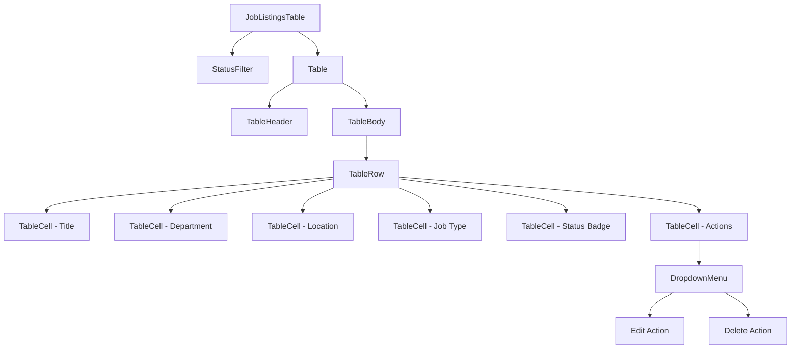

# Job Listings Table Component Plan

## Overview

Create a new table component for displaying job listings based on the existing shadcn table components. The component will display all fields from `newJobSchema` plus a status field, with simple filtering and action buttons.

## Fields to Display

Based on [`newJobSchema`](lib/schema.ts:3) in `lib/schema.ts`:

| Field         | Type   | Description                                        |
| ------------- | ------ | -------------------------------------------------- |
| `title`       | string | Job title (5-80 characters)                        |
| `description` | string | Job description (max 5000 characters)              |
| `location`    | string | Job location (max 50 characters)                   |
| `department`  | enum   | Tech, GTM, operations, other                       |
| `jobType`     | enum   | full-time, internship, part-time / working student |
| `status`      | enum   | draft, active, paused, expired                     |

## Component Architecture



## Type Definitions

```typescript
// Type for the job listing data
export type JobStatus = "draft" | "active" | "paused" | "expired";

export type Department = "Tech" | "GTM" | "operations" | "other";

export type JobType =
  | "full-time"
  | "internship"
  | "part-time / working student";

export interface JobListing {
  id: string;
  title: string;
  description: string;
  location: string;
  department: Department;
  jobType: JobType;
  status: JobStatus;
}
```

## Component Props

```typescript
interface JobListingsTableProps {
  data: JobListing[];
  onEdit?: (id: string) => void;
  onDelete?: (id: string) => void;
}
```

## Status Badge Colors

| Status  | Badge Variant | Color         |
| ------- | ------------- | ------------- |
| draft   | secondary     | Gray          |
| active  | default       | Green/Primary |
| paused  | outline       | Yellow/Orange |
| expired | destructive   | Red           |

## Files to Create

### 1. `components/job-listings-table.tsx`

Main table component with:

- Status filter dropdown at the top
- Table displaying all job listing fields
- Status badges with appropriate colors
- Actions dropdown menu with edit/delete options

### 2. Update `lib/schema.ts` (optional)

Add the status field and export types for reuse

## Implementation Details

### Status Filter

- Simple dropdown/select to filter by status
- Options: All, Draft, Active, Paused, Expired
- Client-side filtering using `useState`

### Table Structure

- Uses existing shadcn table components from `components/ui/table.tsx`
- Uses Badge component for status display
- Uses DropdownMenu for actions

### Actions Column

- Edit button - triggers `onEdit` callback with job id
- Delete button - triggers `onDelete` callback with job id
- Uses dropdown menu pattern from existing `columns.tsx`

## Example Usage

```tsx
import { JobListingsTable } from "@/components/job-listings-table";

// Sample data
const jobs = [
  {
    id: "1",
    title: "Senior Frontend Developer",
    description: "We are looking for...",
    location: "Berlin, Germany",
    department: "Tech",
    jobType: "full-time",
    status: "active",
  },
  // ... more jobs
];

// In a page component
<JobListingsTable
  data={jobs}
  onEdit={(id) => console.log("Edit:", id)}
  onDelete={(id) => console.log("Delete:", id)}
/>;
```

## Dependencies

All dependencies are already installed:

- `lucide-react` - for icons
- Existing shadcn UI components (table, badge, button, dropdown-menu, select)

## Simplicity Considerations

To keep the component simple:

1. No server-side data fetching - data passed as props
2. Client-side filtering only
3. No pagination (can be added later if needed)
4. No complex sorting (just basic table structure)
5. Callbacks for edit/delete actions - parent handles actual logic

## Implementation Status

✅ **Completed** - The component has been created at `components/job-listings-table.tsx`

### Component Features:

- Type definitions exported: `JobListing`, `JobStatus`, `Department`, `JobType`
- Status filter dropdown with options: All, Draft, Active, Paused, Expired
- Color-coded status badges (secondary=draft, default=active, outline=paused, destructive=expired)
- Actions dropdown menu with Edit and Delete options
- Empty state message when no jobs match the filter
