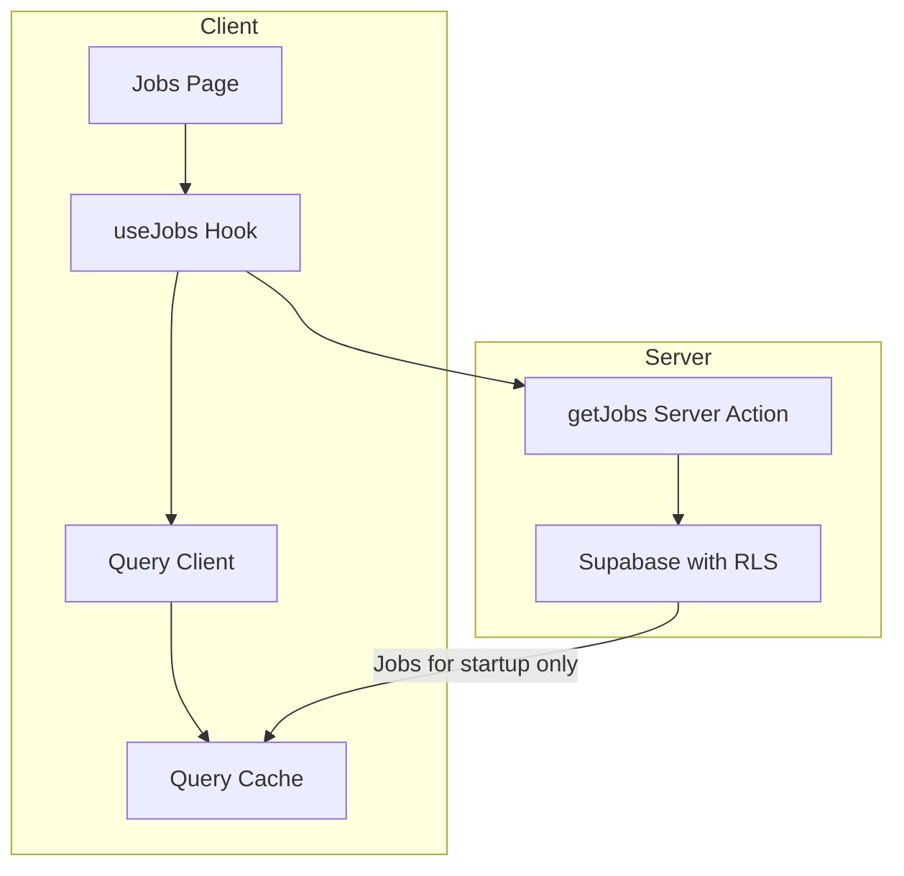

# Jobs Table with TanStack Query - Implementation Plan

## Overview

Implement fetching jobs from the database using TanStack Query (React Query) with best practices, allowing reusable server state access across the application.

## Current State

- `@tanstack/react-query` v5.90.21 is already installed
- Jobs page at [`app/dashboard/(sidebar)/jobs/page.tsx`](<app/dashboard/(sidebar)/jobs/page.tsx>) uses mock data
- [`JobRow`](lib/types/job.ts:68) type exists matching Supabase schema
- [`createJob`](lib/actions.ts:140) server action exists for creating jobs
- RLS is configured - each startup can only see their own jobs

## Architecture



## Implementation Steps

### 1. Create QueryProvider Component

**File:** `components/providers/query-provider.tsx`

Wrap the application with QueryClientProvider to enable TanStack Query:

```typescript
"use client";

import { QueryClient, QueryClientProvider } from "@tanstack/react-query";
import { useState } from "react";

export function QueryProvider({ children }: { children: React.ReactNode }) {
  const [queryClient] = useState(
    () =>
      new QueryClient({
        defaultOptions: {
          queries: {
            staleTime: 60 * 1000, // 1 minute
            gcTime: 5 * 60 * 1000, // 5 minutes (formerly cacheTime)
          },
        },
      })
  );

  return (
    <QueryClientProvider client={queryClient}>
      {children}
    </QueryClientProvider>
  );
}
```

### 2. Update Root Layout

**File:** `app/layout.tsx`

Wrap children with QueryProvider alongside existing ThemeProvider.

### 3. Create Query Keys Factory

**File:** `lib/queries/keys.ts`

Centralized query keys following best practices for cache management:

```typescript
export const jobKeys = {
  all: ["jobs"] as const,
  lists: () => [...jobKeys.all, "list"] as const,
  list: (filters: Record<string, unknown>) =>
    [...jobKeys.lists(), filters] as const,
  details: () => [...jobKeys.all, "detail"] as const,
  detail: (id: string) => [...jobKeys.details(), id] as const,
};
```

### 4. Create getJobs Server Action

**File:** `lib/actions.ts` (add to existing file)

```typescript
export async function getJobs(): Promise<{
  success: boolean;
  data?: JobRow[];
  error?: string;
}> {
  const supabase = await createClient();

  const { data, error } = await supabase
    .from("jobs")
    .select("*")
    .order("created_at", { ascending: false });

  if (error) {
    return { success: false, error: error.message };
  }

  return { success: true, data };
}
```

RLS automatically filters to only the authenticated startup's jobs.

### 5. Create useJobs Hook

**File:** `hooks/use-jobs.ts`

Reusable hook with TanStack Query best practices:

```typescript
"use client";

import { useQuery } from "@tanstack/react-query";
import { getJobs } from "@/lib/actions";
import { jobKeys } from "@/lib/queries/keys";
import type { JobRow } from "@/lib/types/job";

export function useJobs() {
  return useQuery({
    queryKey: jobKeys.lists(),
    queryFn: getJobs,
    select: (result) => {
      if (!result.success || !result.data) {
        throw new Error(result.error || "Failed to fetch jobs");
      }
      return result.data;
    },
  });
}

// Hook for transformed display data
export function useJobListings() {
  const { data: jobs, ...queryResult } = useJobs();

  const jobListings = jobs?.map(transformJobRowToListing);

  return { ...queryResult, data: jobListings };
}

function transformJobRowToListing(job: JobRow): JobListing {
  return {
    id: String(job.id),
    title: job.title,
    description: job.description,
    location: job.location ?? "",
    department: job.department,
    jobType: job.job_type,
    status: job.status,
    createdAt: new Date(job.created_at),
  };
}
```

### 6. Update Jobs Page

**File:** `app/dashboard/(sidebar)/jobs/page.tsx`

Replace mock data with the useJobs hook:

```typescript
"use client";

import { useJobListings } from "@/hooks/use-jobs";
// ... other imports

export default function JobListingsPage() {
  const { data: jobListings, isLoading, error } = useJobListings();

  if (isLoading) {
    return <JobsLoadingSkeleton />;
  }

  if (error) {
    return <JobsErrorState error={error} />;
  }

  // Rest of component using jobListings
}
```

## File Structure

```
lib/
├── actions.ts          # Add getJobs server action
├── queries/
│   └── keys.ts         # Query keys factory (NEW)
hooks/
├── use-mobile.ts       # Existing
└── use-jobs.ts         # NEW - useJobs hook
components/
├── providers/
│   └── query-provider.tsx  # NEW - QueryClientProvider wrapper
app/
└── layout.tsx          # Update to include QueryProvider
```

## Benefits

1. **Reusability**: `useJobs()` can be called from any component
2. **Automatic Caching**: Jobs data is cached and shared
3. **Background Refetching**: Data stays fresh automatically
4. **Loading/Error States**: Built-in loading and error handling
5. **Deduplication**: Multiple components using same query = single request
6. **Type Safety**: Full TypeScript support throughout

## Cache Invalidation

When creating/updating/deleting jobs, invalidate the cache:

```typescript
import { useQueryClient } from "@tanstack/react-query";
import { jobKeys } from "@/lib/queries/keys";

// In your mutation handler
const queryClient = useQueryClient();
await queryClient.invalidateQueries({ queryKey: jobKeys.lists() });
```

## Next Steps After Implementation

1. Add optimistic updates for job mutations
2. Implement job detail query with `useJob(id)`
3. Add real-time subscriptions with Supabase Realtime
