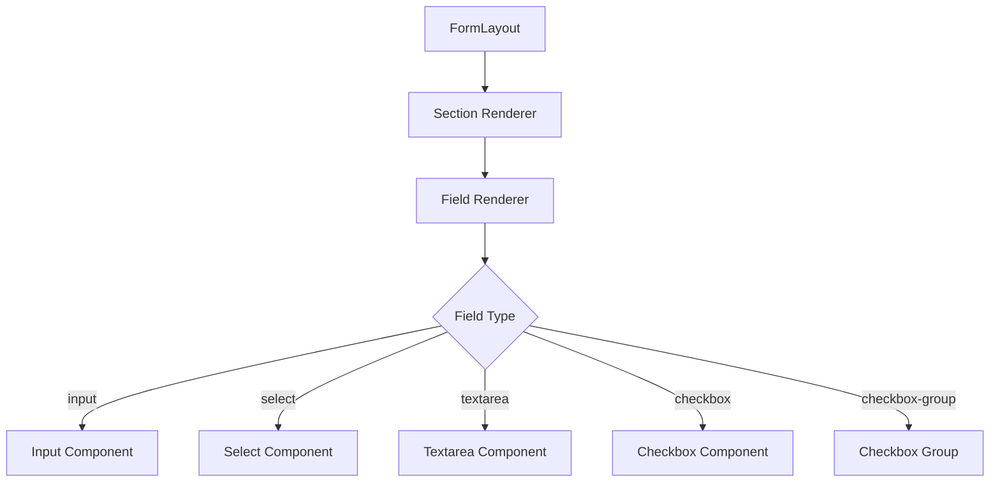

# Modular FormLayout Component Plan

## Overview

Transform the hardcoded `FormLayout03` component into a reusable, configurable form layout component that accepts section definitions through props.

## Type Definitions

### Field Types

```typescript
// Field type enum
type FieldType =
  | "input"
  | "select"
  | "checkbox"
  | "textarea"
  | "checkbox-group";

// Field width options
type FieldWidth = "full" | "half"; // half = col-span-3 in 6-column grid
```

### Field Configuration

```typescript
interface BaseFieldConfig {
  id: string;
  name: string;
  label: string;
  type: FieldType;
  width?: FieldWidth;
  required?: boolean;
  disabled?: boolean;
  description?: string;
  placeholder?: string;
}

interface InputFieldConfig extends BaseFieldConfig {
  type: "input";
  inputType?: "text" | "email" | "number" | "password" | "tel" | "url";
  autoComplete?: string;
}

interface SelectFieldConfig extends BaseFieldConfig {
  type: "select";
  options: { value: string; label: string }[];
  defaultValue?: string;
}

interface CheckboxFieldConfig extends BaseFieldConfig {
  type: "checkbox";
  defaultChecked?: boolean;
}

interface CheckboxGroupFieldConfig extends BaseFieldConfig {
  type: "checkbox-group";
  options: { value: string; label: string }[];
  defaultValues?: string[];
}

interface TextareaFieldConfig extends BaseFieldConfig {
  type: "textarea";
  rows?: number;
}

type FieldConfig =
  | InputFieldConfig
  | SelectFieldConfig
  | CheckboxFieldConfig
  | CheckboxGroupFieldConfig
  | TextareaFieldConfig;
```

### Section Configuration

```typescript
interface FormSection {
  title: string;
  subtitle?: string;
  fields: FieldConfig[];
}
```

### Component Props

```typescript
interface FormLayoutProps {
  sections: FormSection[];
  onSubmit?: (data: Record<string, FormDataEntryValue>) => void;
  submitLabel?: string;
  cancelLabel?: string;
  onCancel?: () => void;
}
```

## Component Architecture

### Mermaid Diagram



## Implementation Details

### 1. Field Width Mapping

| Width | CSS Classes                   |
| ----- | ----------------------------- |
| full  | `col-span-full`               |
| half  | `col-span-full sm:col-span-3` |

### 2. Grid System

- Outer grid: `md:grid-cols-3`
- Section content: `md:col-span-2`
- Inner field grid: `sm:grid-cols-6`

### 3. Field Rendering Strategy

Each field type maps to appropriate UI components:

- **Input**: Uses `Input` component from `@/components/ui/input`
- **Select**: Uses `Select`, `SelectTrigger`, `SelectContent`, `SelectItem` from `@/components/ui/select`
- **Textarea**: Uses `Textarea` component from `@/components/ui/textarea`
- **Checkbox**: Uses `Checkbox` component from `@/components/ui/checkbox`
- **Checkbox-group**: Renders multiple checkboxes in a group

### 4. Form Structure

```jsx
<form>
  {sections.map((section, index) => (
    <>
      <SectionRenderer section={section} />
      {index < sections.length - 1 && <Separator />}
    </>
  ))}
  <ActionButtons />
</form>
```

## Files to Create/Modify

1. **Create**: `components/form-layout/types.ts` - Type definitions
2. **Create**: `components/form-layout/form-field.tsx` - Individual field renderer
3. **Create**: `components/form-layout/form-section.tsx` - Section renderer
4. **Create**: `components/form-layout/form-layout.tsx` - Main component
5. **Create**: `components/form-layout/index.ts` - Barrel export
6. **Modify**: `components/form-layout-03.tsx` - Use new modular component

## Usage Example

```tsx
import { FormLayout } from "@/components/form-layout";

const sections = [
  {
    title: "Personal Information",
    subtitle: "Tell us about yourself",
    fields: [
      {
        type: "input",
        id: "first-name",
        name: "firstName",
        label: "First Name",
        width: "half",
        required: true,
        placeholder: "Emma",
      },
      {
        type: "input",
        id: "last-name",
        name: "lastName",
        label: "Last Name",
        width: "half",
        required: true,
        placeholder: "Crown",
      },
      {
        type: "input",
        id: "email",
        name: "email",
        label: "Email",
        type: "email",
        required: true,
        placeholder: "emma@company.com",
      },
    ],
  },
  {
    title: "Notification Settings",
    fields: [
      {
        type: "checkbox-group",
        id: "notifications",
        name: "notifications",
        label: "Notifications",
        options: [
          { value: "email", label: "Email notifications" },
          { value: "push", label: "Push notifications" },
        ],
      },
    ],
  },
];

export default function MyForm() {
  return (
    <FormLayout
      sections={sections}
      submitLabel="Save"
      cancelLabel="Cancel"
      onSubmit={(data) => console.log(data)}
    />
  );
}
```

## Backward Compatibility

The existing `FormLayout03` component will be refactored to use the new modular component with hardcoded configuration, ensuring no breaking changes for existing consumers.

## Acceptance Criteria

1. ✅ Component accepts `sections` prop with array of section configurations
2. ✅ Each section has title, subtitle, and fields array
3. ✅ Fields support: input, select, textarea, checkbox, checkbox-group
4. ✅ Fields support width: full (col-span-full) or half (col-span-3)
5. ✅ All existing UI components are reused (no duplication)
6. ✅ Form is fully functional with proper form submission
7. ✅ Original FormLayout03 maintains visual equivalence
8. ✅ TypeScript types are comprehensive and type-safe
