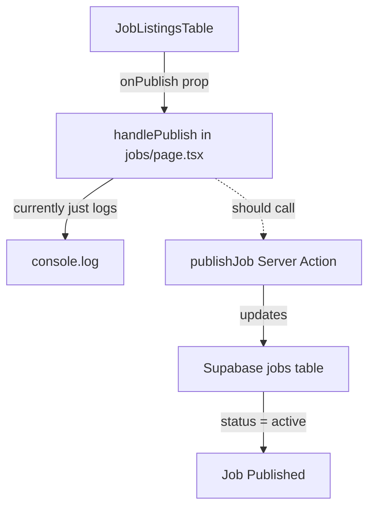

# Plan: Implement onPublish Functionality

## Overview

The `onPublish` function should set the status of a job from "draft" to "active". Currently, the `handlePublish` function in the jobs page only logs to console and does not actually update the job status.

## Current Implementation Analysis

### Component Flow



### Key Files

1. **[`components/job-listings-table.tsx`](components/job-listings-table.tsx)**
   - Has `onPublish` prop at line 45
   - Publish menu item calls `onPublish?.(job.id)` at lines 131-134
   - Publish button is disabled when `job.status !== "draft"` at line 135

2. **[`app/dashboard/(sidebar)/jobs/page.tsx`](<app/dashboard/(sidebar)/jobs/page.tsx>)**
   - `handlePublish` function at lines 275-277 - currently just logs
   - Passed to `JobListingsTable` at line 357

3. **[`lib/actions.ts`](lib/actions.ts)**
   - Has `createJob` function that creates jobs with status "draft"
   - **Missing**: `publishJob` function to update status to "active"

4. **[`hooks/use-jobs.ts`](hooks/use-jobs.ts)**
   - Has `useInvalidateJobs` hook for cache invalidation
   - **Missing**: Mutation hook for publishing jobs

## Implementation Steps

### Step 1: Add `publishJob` Server Action

Add a new server action in [`lib/actions.ts`](lib/actions.ts):

```typescript
export async function publishJob(
  jobId: string,
): Promise<{ success: boolean; error?: string }> {
  const supabase = await createClient();

  const { error } = await supabase
    .from("jobs")
    .update({ status: "active" })
    .eq("id", jobId);

  if (error) {
    return { success: false, error: error.message };
  }

  revalidatePath("/dashboard/jobs");
  return { success: true };
}
```

### Step 2: Update `handlePublish` in Jobs Page

Update the `handlePublish` function in [`app/dashboard/(sidebar)/jobs/page.tsx`](<app/dashboard/(sidebar)/jobs/page.tsx>) with loading state indication:

```typescript
import { publishJob } from "@/lib/actions";
import { toast } from "sonner";

const handlePublish = async (id: string) => {
  // Show loading toast
  const toastId = toast.loading("Publishing job...");

  const result = await publishJob(id);

  if (result.success) {
    toast.success("Job published successfully", { id: toastId });
    // Invalidate the jobs query to refresh the list
    invalidateJobs();
  } else {
    toast.error(result.error || "Failed to publish job", { id: toastId });
  }
};
```

**Alternative using `toast.promise()` (cleaner approach):**

```typescript
const handlePublish = (id: string) => {
  toast.promise(publishJob(id), {
    loading: "Publishing job...",
    success: (result) => {
      if (result.success) {
        invalidateJobs();
        return "Job published successfully";
      }
      throw new Error(result.error || "Failed to publish job");
    },
    error: (err) => err.message || "Failed to publish job",
  });
};
```

### Step 3: Add `usePublishJob` Mutation Hook (Recommended)

Add a mutation hook in [`hooks/use-jobs.ts`](hooks/use-jobs.ts) for better React Query integration:

```typescript
import { useMutation } from "@tanstack/react-query";
import { publishJob } from "@/lib/actions";

export function usePublishJob() {
  const queryClient = useQueryClient();
  const invalidateJobs = useInvalidateJobs();

  return useMutation({
    mutationFn: publishJob,
    onSuccess: (result) => {
      if (result.success) {
        invalidateJobs();
      }
    },
  });
}
```

### Step 4: Use the Mutation Hook in Jobs Page

Update the jobs page to use the mutation hook:

```typescript
const { mutate: publishJobMutation, isPending: isPublishing } = usePublishJob();

const handlePublish = (id: string) => {
  publishJobMutation(id, {
    onSuccess: (result) => {
      if (result.success) {
        toast.success("Job published successfully");
      } else {
        toast.error(result.error || "Failed to publish job");
      }
    },
  });
};
```

## Files to Modify

| File                                                                               | Changes                                      |
| ---------------------------------------------------------------------------------- | -------------------------------------------- |
| [`lib/actions.ts`](lib/actions.ts)                                                 | Add `publishJob` server action               |
| [`hooks/use-jobs.ts`](hooks/use-jobs.ts)                                           | Add `usePublishJob` mutation hook            |
| [`app/dashboard/(sidebar)/jobs/page.tsx`](<app/dashboard/(sidebar)/jobs/page.tsx>) | Update `handlePublish` to call server action |

## Optional Enhancements

1. **Loading State**: Add loading indicator while publishing
2. **Optimistic Update**: Update UI immediately before server response
3. **Error Boundary**: Handle errors gracefully with retry option
