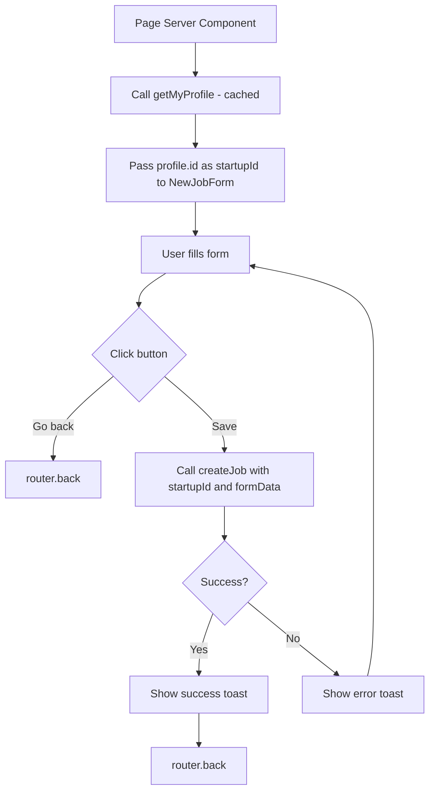

# Implementation Plan: Save and Go Back Buttons for Job Form

## Overview

Implement the "Save" and "Go back" buttons in the [`NewJobForm`](components/forms/new_job_form.tsx) component. The "Go back" button should navigate to the previous page in browser history, and the "Save" button should create a new job using the [`createJob`](lib/actions.ts:140) server action, show a success toast, and then navigate back.

## Current State

- [`NewJobForm`](components/forms/new_job_form.tsx) is a client component using react-hook-form with Zod validation
- [`createJob`](lib/actions.ts:140) server action requires `startupId` as a parameter
- [`getMyProfile()`](lib/data/user.ts:5) is a cached function to get the user's profile
- Form has placeholder buttons that don't do anything yet
- Sonner is NOT installed in the project

## Implementation Steps

### Step 1: Install Sonner

Run the shadcn CLI to add the sonner component:

```bash
pnpm dlx shadcn@latest add sonner
```

This will:

- Install the `sonner` package
- Create [`components/ui/sonner.tsx`](components/ui/sonner.tsx)

### Step 2: Add Toaster to Layout

**File:** [`app/layout.tsx`](app/layout.tsx)

Add the Toaster component to the root layout so toasts can be displayed anywhere in the app:

```typescript
import { Toaster } from "@/components/ui/sonner";

// In the return statement, add:
<Toaster />
```

### Step 3: Update Page Component to Pass startupId

**File:** [`app/dashboard/(fullscreen)/jobs/new/page.tsx`](<app/dashboard/(fullscreen)/jobs/new/page.tsx>)

Use [`getMyProfile()`](lib/data/user.ts:5) to get the profile and pass the ID:

```typescript
import { NewJobForm } from "@/components/forms/new_job_form";
import { getMyProfile } from "@/lib/data/user";

export default async function Page() {
  const profile = await getMyProfile();

  if (!profile) {
    // Handle unauthenticated state - could redirect to login
    return null;
  }

  return (
    <div className="flex justify-center items-center p-10 pb-0">
      <NewJobForm startupId={profile.id} />
    </div>
  );
}
```

### Step 4: Update NewJobForm Component

**File:** [`components/forms/new_job_form.tsx`](components/forms/new_job_form.tsx)

Changes needed:

1. **Add props interface:**
   - Accept `startupId` as a required prop

2. **Add imports:**
   - `useRouter` from `next/navigation`
   - `createJob` from `@/lib/actions`
   - `useState` from `react` for loading/error states
   - `toast` from `sonner`

3. **Add state management:**
   - `isSubmitting` state for loading indicator

4. **Implement onSubmit handler:**
   - Call `createJob` with `startupId` and form data
   - On success: show success toast, then navigate back
   - On error: show error toast

5. **Implement "Go back" button:**
   - Use `router.back()` to navigate to previous page

6. **Update "Save" button:**
   - Show loading state while submitting
   - Disable during submission

### Code Changes for NewJobForm

```typescript
"use client";

import { useRouter } from "next/navigation";
import { useState } from "react";
import { Controller, useForm } from "react-hook-form";
import { zodResolver } from "@hookform/resolvers/zod";
import { newJobSchema } from "@/lib/schema";
import {
  DEPARTMENT_LABELS,
  JOB_TYPE_LABELS,
  type JobFormData,
} from "@/lib/types/job";
import { createJob } from "@/lib/actions";
import { toast } from "sonner";

// ... existing imports ...

interface NewJobFormProps {
  startupId: string;
}

export function NewJobForm({ startupId }: NewJobFormProps) {
  const router = useRouter();
  const [isSubmitting, setIsSubmitting] = useState(false);

  const form = useForm<JobFormData>({
    // ... existing form config ...
  });

  async function onSubmit(data: JobFormData) {
    setIsSubmitting(true);

    const result = await createJob(startupId, data);

    if (result.success) {
      toast.success("Job created successfully");
      router.back();
    } else {
      toast.error(result.error || "Failed to create job");
      setIsSubmitting(false);
    }
  }

  // In the JSX:
  // - "Go back" button: onClick={() => router.back()}
  // - "Save" button: disabled={isSubmitting}, show loading state
}
```

## Files to Modify

| File                                                                                             | Changes                                                                 |
| ------------------------------------------------------------------------------------------------ | ----------------------------------------------------------------------- |
| [`package.json`](package.json)                                                                   | Add sonner dependency (via shadcn CLI)                                  |
| [`components/ui/sonner.tsx`](components/ui/sonner.tsx)                                           | New file created by shadcn CLI                                          |
| [`app/layout.tsx`](app/layout.tsx)                                                               | Add Toaster component                                                   |
| [`app/dashboard/(fullscreen)/jobs/new/page.tsx`](<app/dashboard/(fullscreen)/jobs/new/page.tsx>) | Use getMyProfile() and pass startupId to NewJobForm                     |
| [`components/forms/new_job_form.tsx`](components/forms/new_job_form.tsx)                         | Accept startupId prop, add router, toast, and implement button handlers |

## Flow Diagram



## Notes

- Using [`getMyProfile()`](lib/data/user.ts:5) which is cached with `cache()` from React
- Using `router.back()` for navigation respects browser history
- Sonner toast provides user feedback before navigation
- Loading state prevents double-submission
- The `createJob` server action signature remains unchanged
