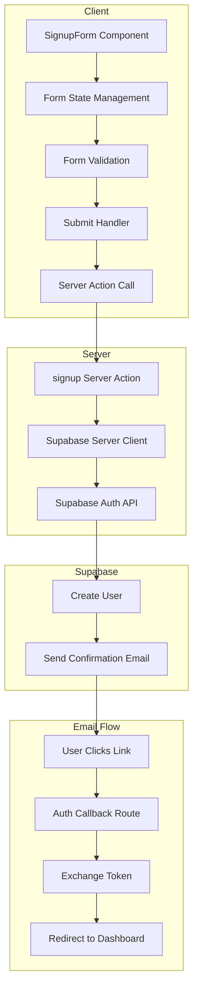

# Supabase Auth Integration Plan

## Overview

Connect the existing Next.js SignupForm component to Supabase authentication with email confirmation required.

## Current State

- **Dependencies**: `@supabase/ssr` and `@supabase/supabase-js` already installed
- **SignupForm**: Basic form exists at [`components/signup-form.tsx`](../components/signup-form.tsx) without form handling
- **Supabase utilities**: Empty directory at [`lib/supabase/`](../lib/supabase/)
- **Environment**: No `.env.local` file exists yet

## Architecture



## Implementation Steps

### 1. Environment Variables

Create `.env.local` with:

```env
NEXT_PUBLIC_SUPABASE_URL=your_supabase_project_url
NEXT_PUBLIC_SUPABASE_ANON_KEY=your_supabase_anon_key
```

### 2. Supabase Client Utilities

#### Browser Client - [`lib/supabase/client.ts`](../lib/supabase/client.ts)

Creates a singleton Supabase client for client-side usage:

```typescript
import { createBrowserClient } from "@supabase/ssr";

export function createClient() {
  return createBrowserClient(
    process.env.NEXT_PUBLIC_SUPABASE_URL!,
    process.env.NEXT_PUBLIC_SUPABASE_ANON_KEY!,
  );
}
```

#### Server Client - [`lib/supabase/server.ts`](../lib/supabase/server.ts)

Creates a Supabase client for server-side usage with cookie handling:

```typescript
import { createServerClient } from "@supabase/ssr";
import { cookies } from "next/headers";

export async function createClient() {
  const cookieStore = await cookies();

  return createServerClient(
    process.env.NEXT_PUBLIC_SUPABASE_URL!,
    process.env.NEXT_PUBLIC_SUPABASE_ANON_KEY!,
    {
      cookies: {
        getAll() {
          return cookieStore.getAll();
        },
        setAll(cookiesToSet) {
          try {
            cookiesToSet.forEach(({ name, value, options }) =>
              cookieStore.set(name, value, options),
            );
          } catch {
            // Handle cookie setting in middleware
          }
        },
      },
    },
  );
}
```

### 3. Signup Server Action - [`app/actions/auth.ts`](../app/actions/auth.ts)

```typescript
"use server";

import { createClient } from "@/lib/supabase/server";
import { redirect } from "next/navigation";

export async function signup(formData: FormData) {
  const supabase = await createClient();

  const email = formData.get("email") as string;
  const password = formData.get("password") as string;
  const fullName = formData.get("name") as string;

  const { error } = await supabase.auth.signUp({
    email,
    password,
    options: {
      emailRedirectTo: `${process.env.NEXT_PUBLIC_SITE_URL}/auth/callback`,
      data: {
        full_name: fullName,
      },
    },
  });

  if (error) {
    return { error: error.message };
  }

  return { success: true };
}
```

### 4. Updated SignupForm Component

Key changes to [`components/signup-form.tsx`](../components/signup-form.tsx):

1. **Add client-side state** using React useState
2. **Add form validation** for password match and length
3. **Handle form submission** with loading states
4. **Display success message** after signup
5. **Show error messages** from Supabase

```typescript
"use client";

import { useState } from "react";
import { signup } from "@/app/actions/auth";
// ... existing imports

export function SignupForm({ className, ...props }) {
  const [error, setError] = useState<string | null>(null);
  const [success, setSuccess] = useState(false);
  const [isLoading, setIsLoading] = useState(false);

  async function handleSubmit(formData: FormData) {
    setIsLoading(true);
    setError(null);

    const result = await signup(formData);

    setIsLoading(false);

    if (result.error) {
      setError(result.error);
    } else {
      setSuccess(true);
    }
  }

  // Render success state or form
}
```

### 5. Auth Callback Route - [`app/auth/callback/route.ts`](../app/auth/callback/route.ts)

Handles the email confirmation callback:

```typescript
import { createClient } from "@/lib/supabase/server";
import { NextResponse } from "next/server";

export async function GET(request: Request) {
  const { searchParams, origin } = new URL(request.url);
  const code = searchParams.get("code");
  const next = searchParams.get("next") ?? "/dashboard";

  if (code) {
    const supabase = await createClient();
    const { error } = await supabase.auth.exchangeCodeForSession(code);

    if (!error) {
      return NextResponse.redirect(`${origin}${next}`);
    }
  }

  return NextResponse.redirect(`${origin}/login?error=auth_callback_error`);
}
```

### 6. Middleware for Auth State - [`middleware.ts`](../middleware.ts)

Ensures auth cookies are properly refreshed:

```typescript
import { createServerClient } from "@supabase/ssr";
import { NextResponse, type NextRequest } from "next/server";

export async function middleware(request: NextRequest) {
  let supabaseResponse = NextResponse.next({
    request,
  });

  const supabase = createServerClient(
    process.env.NEXT_PUBLIC_SUPABASE_URL!,
    process.env.NEXT_PUBLIC_SUPABASE_ANON_KEY!,
    {
      cookies: {
        getAll() {
          return request.cookies.getAll();
        },
        setAll(cookiesToSet) {
          cookiesToSet.forEach(({ name, value }) =>
            request.cookies.set(name, value),
          );
          supabaseResponse = NextResponse.next({
            request,
          });
          cookiesToSet.forEach(({ name, value, options }) =>
            supabaseResponse.cookies.set(name, value, options),
          );
        },
      },
    },
  );

  // Refresh session if expired
  await supabase.auth.getUser();

  return supabaseResponse;
}

export const config = {
  matcher: [
    "/((?!_next/static|_next/image|favicon.ico|.*\\.(?:svg|png|jpg|jpeg|gif|webp)$).*)",
  ],
};
```

## File Structure After Implementation

```
start-circle/
|-- .env.local                    # NEW - Supabase credentials
|-- middleware.ts                 # NEW - Auth middleware
|-- app/
|   |-- actions/
|   |   |-- auth.ts               # NEW - Signup server action
|   |-- auth/
|   |   |-- callback/
|   |   |   |-- route.ts          # NEW - Email confirmation callback
|-- components/
|   |-- signup-form.tsx           # MODIFIED - Add form handling
|-- lib/
|   |-- supabase/
|   |   |-- client.ts             # NEW - Browser client
|   |   |-- server.ts             # NEW - Server client
```

## User Flow

1. User fills out signup form with name, email, and password
2. Form validates password match and minimum length
3. On submit, server action calls Supabase auth.signUp
4. Supabase creates user and sends confirmation email
5. Form displays success message asking user to check email
6. User clicks link in email
7. Auth callback route exchanges code for session
8. User is redirected to dashboard

## Error Handling

| Error Type               | User Message                              |
| ------------------------ | ----------------------------------------- |
| Invalid email            | Please enter a valid email address        |
| Password too short       | Password must be at least 8 characters    |
| Passwords dont match     | Passwords do not match                    |
| Email already registered | An account with this email already exists |
| Weak password            | Please choose a stronger password         |
| Network error            | Unable to connect. Please try again       |

## Next Steps After Implementation

1. Create login page and form
2. Add password reset functionality
3. Create protected routes/dashboard
4. Add user profile management
5. Implement OAuth providers if needed
