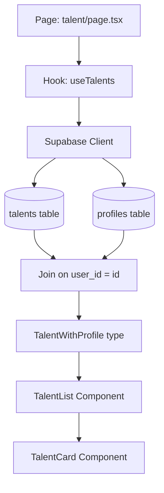

# Talent Pool Page Implementation Plan

## Overview

Build a UI for the dashboard/talent page that displays all people saved in the `talents` table, joined with `profiles` to show additional user information.

## Database Schema Reference

```sql
CREATE TABLE public.talents (
  user_id uuid NOT NULL,
  type text,
  abilities json,
  location text,
  experience_level text,
  cv_url text,
  CONSTRAINT talents_pkey PRIMARY KEY (user_id),
  CONSTRAINT talents_user_id_fkey FOREIGN KEY (user_id) REFERENCES public.profiles(id)
);

CREATE TABLE public.profiles (
  id uuid NOT NULL,
  created_at timestamp with time zone NOT NULL DEFAULT now(),
  role text NOT NULL,
  status text NOT NULL DEFAULT 'in_review'::text,
  updated_at timestamp with time zone,
  email text UNIQUE,
  full_name text NOT NULL DEFAULT 'CHANGE'::text,
  CONSTRAINT profiles_pkey PRIMARY KEY (id)
);
```

## Architecture



## Files to Create/Modify

### 1. Type Definitions - `lib/types/talent.ts`

Define TypeScript types matching the database schema:

```typescript
// Database row type for talents table
export interface TalentRow {
  user_id: string;
  type: string | null;
  abilities: Record<string, unknown> | null;
  location: string | null;
  experience_level: string | null;
  cv_url: string | null;
}

// Joined type with profile data
export interface TalentWithProfile {
  userId: string;
  fullName: string;
  email: string | null;
  role: string;
  profileStatus: string;
  type: string | null;
  abilities: Record<string, unknown> | null;
  location: string | null;
  experienceLevel: string | null;
  cvUrl: string | null;
}

// Constants for experience levels
export const EXPERIENCE_LEVEL = {
  JUNIOR: "junior",
  MID: "mid",
  SENIOR: "senior",
  LEAD: "lead",
  EXECUTIVE: "executive",
} as const;

// Constants for talent types
export const TALENT_TYPE = {
  INDIVIDUAL: "individual",
  FREELANCE: "freelance",
  AGENCY: "agency",
} as const;
```

### 2. Query Keys - `lib/queries/keys.ts`

Add talent query keys following the existing pattern:

```typescript
export const talentKeys = {
  all: ["talents"] as const,
  lists: () => [...talentKeys.all, "list"] as const,
  list: (filters: Record<string, unknown>) =>
    [...talentKeys.lists(), filters] as const,
  details: () => [...talentKeys.all, "detail"] as const,
  detail: (id: string) => [...talentKeys.details(), id] as const,
} as const;
```

### 3. Custom Hook - `hooks/use-talents.ts`

Create a hook following the `use-jobs.ts` pattern:

```typescript
export function useTalents() {
  return useQuery({
    queryKey: talentKeys.lists(),
    queryFn: fetchTalents,
  });
}

async function fetchTalents(): Promise<TalentWithProfile[]> {
  const supabase = createClient();

  const { data, error } = await supabase
    .from("talents")
    .select(
      `
      user_id,
      type,
      abilities,
      location,
      experience_level,
      cv_url,
      profiles!talents_user_id_fkey (
        id,
        full_name,
        email,
        role,
        status
      )
    `,
    )
    .order("user_id");

  // Transform and return data
}
```

### 4. Components

#### TalentCard Component

Display individual talent with:

- Avatar with initials
- Name and role
- Location badge
- Experience level badge
- Skills/abilities tags
- Contact button

#### TalentList Component

Display grid/list of talent cards with:

- Responsive grid layout
- Loading skeleton states
- Empty state handling

### 5. Page - `app/dashboard/(sidebar)/talent/page.tsx`

Main page with:

- Header with title and description
- Search input
- Filter popover with:
  - Experience level filter
  - Location filter
  - Talent type filter
- Talent list/grid
- Loading, error, and empty states

### 6. Sidebar Update - `components/app-sidebar.tsx`

Update the Talent section to link to the new page:

```typescript
{
  title: "Talent",
  url: "#",
  icon: <Users />,
  items: [
    {
      title: "Talent Pool",
      url: "/dashboard/talent",  // Update this
    },
    // ...
  ],
}
```

## UI Components to Use

From existing UI library:

- `Card`, `CardHeader`, `CardTitle`, `CardDescription`, `CardContent`
- `Avatar`, `AvatarFallback`, `AvatarImage`
- `Badge`
- `Button`
- `Input` for search
- `Select` for filters
- `Popover` for filter dropdown
- `Skeleton` for loading states

## Implementation Order

1. **Types** - Define all TypeScript types first
2. **Query Keys** - Add talent keys to existing file
3. **Hook** - Create the data fetching hook
4. **Components** - Build TalentCard and TalentList
5. **Page** - Assemble everything in the page
6. **Sidebar** - Update navigation link

## Questions Resolved

1. **Data to Display**: Join with profiles to show full_name, email, role
2. **Page Purpose**: Main Talent Pool page showing all talents
3. **Features**: Search, filtering, and Contact action

## Future Enhancements (Out of Scope)

- Save talent functionality
- Outreach history tracking
- Talent detail view
- Pagination for large datasets
